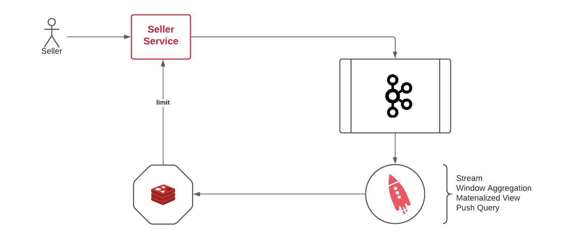

## Pre-reqs
- Docker
- Apache Bench or Curl

## Pre-Flight Setup
- cd PROJECT-DIRECTORY/
- docker-compose up

## Demo

### Part 0 - Build Source Code
Execute below command to seller-service directory.
```
cd seller-service
docker build -t seller-service .
```

Execute below command to seller-anomaly-consumer directory.
```
cd ../seller-anomaly-consumer
docker build -t seller-anomaly-consumer .
```

Execute below command to root directory.
```
docker-compose up
```
Make sure zookeeper, broker, ksqldb-server, ksqldb-cli, redis, seller-service and seller-anomaly-consumer have started.
Please check `docker ps` command.

### Part 1 - Create streams and tables with ksqldb-cli

- Connect to the ksqldb-cli container.
```
docker exec -it ksqldb-cli ksql http://ksqldb-server:8088
```
- Create a stream, and a table with the below commands.
```
CREATE STREAM DEMO_SELLER_CORE_SELLER_REQUEST_STREAM (
	ip VARCHAR,
	agent VARCHAR,
	sellerId BIGINT,
	appName VARCHAR, 
	requestType VARCHAR,
	requestTime BIGINT
) 
WITH (
	KAFKA_TOPIC = 'demo.seller-core.seller-request',
	VALUE_FORMAT = 'JSON',
	PARTITIONS = 1,
	REPLICAS = 1
);

CREATE TABLE DEMO_SELLER_CORE_SELLER_ANOMALY_DETECTED_TABLE WITH (
    KAFKA_TOPIC = 'demo.seller-core.seller-anomaly-detected',
    VALUE_FORMAT = 'json',
    PARTITIONS = 1,
	REPLICAS = 1
) AS
SELECT SELLERID,
	   as_value(SELLERID) AS seller_id,
       COUNT(*) AS request_count
FROM DEMO_SELLER_CORE_SELLER_REQUEST_STREAM
	WINDOW TUMBLING (SIZE 1 MINUTES, RETENTION 7 DAYS)
GROUP BY SELLERID
HAVING COUNT(*) >= 10
EMIT CHANGES;
```

Part 3 - Test it
- Send bulk request with apache bench 
```
curl --request GET 'localhost:8080/seller/10/orders'  |  jq
```
- Exec to redis container with 
```
docker exec -it redis /bin/sh
```
- Execute the below commands and check to data. 
```
redis-cli
keys *
```
